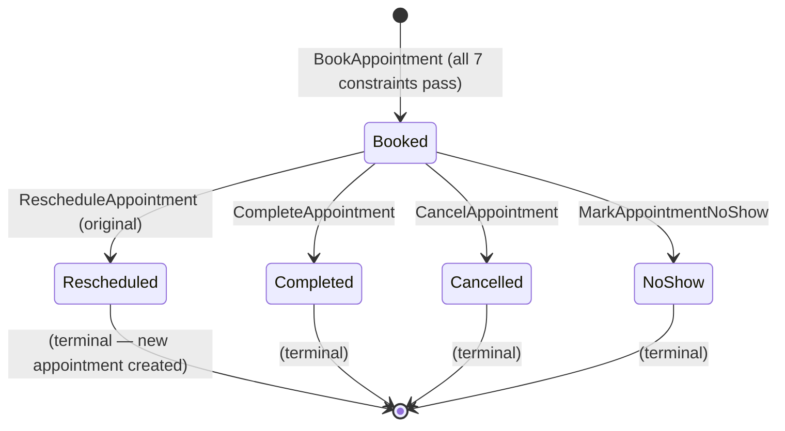

# Appointment Aggregate

**Context**: Patient Scheduling
**Last Updated**: 2026-03-05

---

## Purpose

An Appointment is a scheduled visit by a patient for a specific procedure with a specific provider at a specific office, within a specific time window. The Appointment aggregate enforces all 7 booking constraints and maintains the appointment lifecycle.

Patient Scheduling is the most downstream MVP context — it depends on Practice Setup (office + provider + procedure), Staff Scheduling (provider availability), Patient Management (patient identity), Staff Management (active identity for attribution), and Licensing (scheduling module gate).

---

## Fields

| Field | Type | Required | Notes |
|-------|------|----------|-------|
| id | UUID | Yes | System-generated |
| office_id | UUID | Yes | References Practice Setup Office |
| patient_id | UUID | Yes | References Patient Management Patient |
| procedure_type_id | UUID | Yes | References Practice Setup ProcedureType |
| provider_id | UUID | Yes | References Practice Setup Provider |
| start_time | DateTime (UTC) | Yes | |
| end_time | DateTime (UTC) | Yes | Computed: start + duration_minutes |
| duration_minutes | u32 | Yes | Initial value from ProcedureType.default_duration; overridable (15-240 min) |
| status | AppointmentStatus | Yes | Booked → Completed / Cancelled / NoShow / Rescheduled |
| rescheduled_to_id | UUID? | No | When status is Rescheduled: ID of the new appointment |
| rescheduled_from_id | UUID? | No | When this appointment replaced another: ID of the original |
| notes | List<AppointmentNote> | No | Append-only. Full audit trail. |
| booked_by | staff_member_id | Yes | Who created the booking |

### Value Objects

**AppointmentStatus**: Booked | Completed | Cancelled | NoShow | Rescheduled

**AppointmentNote**:
| Field | Type | Notes |
|-------|------|-------|
| note_id | UUID | System-generated |
| text | String | Required, non-empty |
| recorded_by | staff_member_id | Required — audit trail |
| recorded_at | Timestamp (UTC) | Required |

---

## Events

| Event | Fields | When |
|-------|--------|------|
| **AppointmentBooked** | appointment_id, office_id, patient_id, procedure_type_id, provider_id, start_time, end_time, duration_minutes, booked_by | All 7 constraints pass; appointment created |
| **AppointmentRescheduled** | appointment_id, rescheduled_to_id, rescheduled_by | Original appointment marked terminal; new appointment booked separately |
| **AppointmentCancelled** | appointment_id, cancelled_by, reason? | Appointment cancelled |
| **AppointmentCompleted** | appointment_id, completed_by | Appointment concluded normally |
| **AppointmentMarkedNoShow** | appointment_id, recorded_by | Patient did not arrive |
| **AppointmentNoteAdded** | appointment_id, note_id, text, recorded_by, recorded_at | Staff member adds note |

---

## Commands

| Command | Input | Produces | Preconditions |
|---------|-------|----------|---------------|
| BookAppointment | office_id, patient_id, procedure_type_id, provider_id, start_time, duration_minutes?, booked_by | AppointmentBooked | All 7 booking constraints pass (see Booking Constraints section) |
| RescheduleAppointment | appointment_id, new_office_id, new_provider_id, new_start_time, new_duration_minutes?, rescheduled_by | AppointmentRescheduled (on original) + AppointmentBooked (on new) | Original appointment in Booked status; new slot passes all 7 constraints |
| CancelAppointment | appointment_id, reason?, cancelled_by | AppointmentCancelled | Appointment in Booked or Rescheduled status |
| CompleteAppointment | appointment_id, completed_by | AppointmentCompleted | Appointment in Booked status |
| MarkAppointmentNoShow | appointment_id, recorded_by | AppointmentMarkedNoShow | Appointment in Booked status |
| AddAppointmentNote | appointment_id, text, recorded_by | AppointmentNoteAdded | Appointment exists (any status); text not empty |

---

## Booking Constraints

All 7 must pass for `BookAppointment` to succeed. These are hard stops — no override at MVP.

| # | Constraint | Data Source | Failure Message |
|---|------------|------------|-----------------|
| C1 | Office is open at requested time on that day | Practice Setup `office_hours` projection | "Office [name] is not open at [time] on [day]" |
| C2 | Provider is available at that office at that time (no exception, within availability window) | Staff Scheduling `ResolvedSchedule` projection | "Provider [name] is not available at [office] at [time]" |
| C3 | Chair capacity not exceeded (concurrent Booked appointments at that office at that time < office.chair_count) | Count of Booked appointments overlapping the slot at the office | "No chairs available at [office] at [time] — all [N] chairs are booked" |
| C4 | Patient is active (not archived) | Patient Management `patient_list` projection | "Patient is archived and cannot be scheduled" |
| C5 | Procedure type is active | Practice Setup `procedure_types` projection | "Procedure type [name] is no longer active" |
| C6 | Patient does not already have a Booked appointment at the same time (at any office) | Appointment list projection — all Booked appointments for that patient | "Patient [name] already has an appointment at [time] — a patient cannot be in two chairs at the same time" |
| C7 | Provider type meets or exceeds the procedure's required_provider_type (Specialist ≥ Dentist ≥ Hygienist; None = any) | ProcedureType.required_provider_type; Provider.provider_type | "[procedure_name] requires a [required_type] or higher. [provider_name] is a [provider_type] and is not eligible for this procedure." |

**Chair capacity check**: Count of all Booked appointments at the office whose time window overlaps the proposed slot. Overlap = `existing.start < proposed.end AND existing.end > proposed.start`.

**Provider constraint**: Checked against Staff Scheduling's `ResolvedSchedule` projection (which has already applied exceptions to availability windows).

---

## Invariants

1. **All 7 constraints required**: Booking fails if any constraint is not met
2. **Duration range**: 15-240 minutes (matches ProcedureType.default_duration range)
3. **Status transitions are one-way**: Booked → terminal. Terminal statuses (Completed, Cancelled, NoShow, Rescheduled) cannot be reversed
4. **Notes are append-only**: AppointmentNotes cannot be edited or deleted
5. **Full audit trail**: Every command carries a staff_member_id (booked_by, rescheduled_by, cancelled_by, completed_by, recorded_by)
6. **Reschedule creates two aggregates**: Original gets Rescheduled status (terminal); new appointment is a separate aggregate

---

## State Machine



---

## Projections

### AppointmentList (office schedule view)

Used for the daily schedule (provider-day view) and "today's schedule" dashboard.

```
Table: appointment_list
  appointment_id     UUID
  office_id          UUID
  patient_id         UUID
  patient_name       TEXT    -- Denormalized: "{last_name}, {first_name}"
  patient_phone      TEXT?   -- For call list
  procedure_name     TEXT    -- Denormalized from ProcedureType
  procedure_category TEXT    -- For color-coding
  provider_id        UUID
  provider_name      TEXT    -- Denormalized from Provider
  start_time         DATETIME
  end_time           DATETIME
  duration_minutes   INT
  status             TEXT    -- Booked | Completed | Cancelled | NoShow | Rescheduled
```

### TomorrowsCallList (manual reminder support)

Used by front desk to manually call patients for next-day appointments.

```
Table: tomorrows_call_list
  appointment_id          UUID
  office_id               UUID
  patient_name            TEXT
  patient_phone           TEXT?
  patient_email           TEXT?
  preferred_contact_channel TEXT
  procedure_name          TEXT
  provider_name           TEXT
  start_time              TIME
```

---

## Design Decisions

- **Book, not Create**: Domain language — appointments are "booked", not "created".
- **Hard constraints at MVP**: All 7 booking constraints are hard stops. No override. Override capability is a backlog item.
- **Reschedule = two aggregates**: Preserves complete history. Original appointment gets terminal `Rescheduled` status with a link to the new one. Patient history shows the full trail.
- **Chair capacity is per-office**: Concurrent appointments at one office do not affect another. The constraint is local to the office.
- **Duration from procedure type**: Default duration auto-fills from ProcedureType.default_duration. Overridable within 15-240 minute range.
- **Appointment notes separate from patient notes**: Patient notes are general context about the person. Appointment notes are specific to the visit. Both visible in patient history.
- **Manual call list (MVP reminders)**: SMS/email reminders are post-MVP. Front desk uses the TomorrowsCallList projection to manually contact patients.
- **Patient no double-booking (C6)**: Prevents the same patient from being scheduled in overlapping appointments anywhere in the practice. A patient cannot physically be in two chairs at the same time. The overlap check is practice-wide (not office-scoped), unlike C3. Confirmed by Tony (2026-03-05).
- **Capability check (C7)**: Enforces that the provider type is eligible for the procedure's required level. This is a booking-time check — the booking form also pre-filters the provider dropdown for usability, but the backend enforces it as a hard stop. No override. Confirmed by Tony (2026-03-05).

---

**Maintained By**: Tony + Claude
