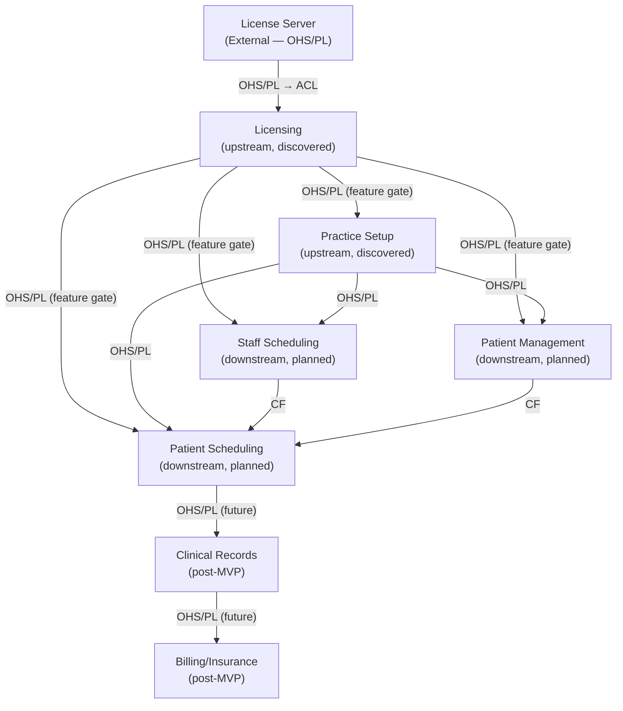

# Context Map

**Last Updated**: 2026-03-03

---

## Overview

This map shows the bounded contexts in Belsouri, their relationships, and the integration patterns between them. Updated as new contexts are discovered through Phase 1 ceremonies.

Practice Setup and Licensing have completed domain discovery. Other contexts are listed based on the development plan with their expected relationships.

---

## Bounded Contexts

| Context | Status | Purpose |
|---------|--------|---------|
| **Licensing** | Discovered (Phase 1 complete) | Machine-bound license validation, eval period, module gating, degraded mode |
| **Practice Setup** | Discovered (Phase 1 complete) | Offices, providers, procedure types, practice identity |
| **Staff Scheduling** | Planned (Phase 3) | Provider availability patterns, working hours, exceptions |
| **Patient Management** | Planned (Phase 4) | Patient registration, demographics, search |
| **Patient Scheduling** | Planned (Phase 5) | Appointment booking, today's schedule, cancellations |
| **Clinical Records** | Planned (Post-MVP) | Charting, treatment plans, clinical notes |
| **Billing/Insurance** | Planned (Post-MVP) | Invoicing, insurance claims, payments |
| **Jamaica EHR Integration** | Planned (Post-MVP) | Regulatory compliance, data export |
| **Reporting** | Deferred (Post-MVP) | Practice-wide dashboards, capacity utilization, provider load. May emerge as a bounded context or remain a cross-cutting concern. |

---

## Context Map Diagram



**Legend**: OHS = Open Host Service, PL = Published Language, CF = Conformist, ACL = Anti-Corruption Layer

---

## Relationships

### License Server → Licensing

| Property | Value |
|----------|-------|
| **Direction** | License Server is upstream (external); Licensing is downstream |
| **Pattern** | Open Host Service / Published Language → Anti-Corruption Layer |
| **What flows** | Signed license keys (LicensePayload + Ed25519 signature, base64url encoded) |
| **Integration** | License Server signs keys; Practice Manager obtains and enters them manually. No runtime API call from the app — fully offline integration. |
| **Contract** | License Server publishes a stable payload schema (schema_version field). Licensing context validates against the schema version it understands. |

**Why ACL on the Licensing side**: The License Server has its own model (REST API, JSON schema). Licensing translates this into domain events (LicenseIssued, LicenseRenewed) using an Anti-Corruption Layer. If the License Server's schema evolves, only the ACL changes — not domain logic.

**Why OHS/PL on the License Server side**: Tony controls both sides. The License Server publishes a stable, versioned schema. Breaking changes require a new schema_version.

---

### Licensing → Practice Setup

| Property | Value |
|----------|-------|
| **Direction** | Licensing is upstream; Practice Setup is downstream |
| **Pattern** | Open Host Service / Published Language (feature gate) |
| **What flows** | Module access decisions (`core` module required for Practice Setup access) |
| **Integration** | Practice Setup feature access is gated by Licensing's `license_status` projection. If the `core` module is not licensed or status is Expired/Invalid, Practice Setup screens are blocked. |
| **Contract** | Practice Setup reads `license_status.modules` and `license_status.status`. It does not call Licensing commands. |

**Why upstream**: Licensing is checked before any Practice Setup operation. Practice Setup cannot function without a valid license.

---

### Licensing → Staff Scheduling

| Property | Value |
|----------|-------|
| **Direction** | Licensing is upstream; Staff Scheduling is downstream |
| **Pattern** | Open Host Service / Published Language (feature gate) |
| **What flows** | Module access decisions (`scheduling` module required) |
| **Integration** | Same pattern as Licensing → Practice Setup. Staff Scheduling reads `license_status` projection. |
| **Contract** | TBD during Phase 3 ceremonies. |

---

### Licensing → Patient Management

| Property | Value |
|----------|-------|
| **Direction** | Licensing is upstream; Patient Management is downstream |
| **Pattern** | Open Host Service / Published Language (feature gate) |
| **What flows** | Module access decisions (`core` module required) |
| **Integration** | Same pattern as Licensing → Practice Setup. |
| **Contract** | TBD during Phase 4 ceremonies. |

---

### Licensing → Patient Scheduling

| Property | Value |
|----------|-------|
| **Direction** | Licensing is upstream; Patient Scheduling is downstream |
| **Pattern** | Open Host Service / Published Language (feature gate) |
| **What flows** | Module access decisions (`scheduling` module required) |
| **Integration** | Same pattern as other Licensing downstream relationships. |
| **Contract** | TBD during Phase 5 ceremonies. |

---

### Practice Setup → Staff Scheduling

| Property | Value |
|----------|-------|
| **Direction** | Practice Setup is upstream; Staff Scheduling is downstream |
| **Pattern** | Open Host Service / Published Language |
| **What flows** | Office configuration (hours, chair count), Provider registration and type |
| **Integration** | Staff Scheduling reads Practice Setup projections to know which offices and providers exist. It does not modify Practice Setup data. |
| **Contract** | Staff Scheduling conforms to Practice Setup's event schema and projection format. |

**Why OHS/PL**: Practice Setup publishes a stable set of events and projections. Staff Scheduling consumes them as-is without translation. The "language" is shared (same Office, Provider terms). Practice Setup doesn't know or care about Staff Scheduling.

**Boundary note**: Provider availability (weekly schedule per office) and exceptions (vacations) are currently modeled in Practice Setup because they are part of provider configuration. If Staff Scheduling needs richer scheduling concepts (shift patterns, approval workflows, time-off requests with denial logic), availability and exceptions may migrate to Staff Scheduling. This is a boundary to revisit during Phase 3 ceremonies.

---

### Practice Setup → Patient Management

| Property | Value |
|----------|-------|
| **Direction** | Practice Setup is upstream; Patient Management is downstream |
| **Pattern** | Open Host Service / Published Language |
| **What flows** | Office list (for patient-office association) |
| **Integration** | Patient Management reads the list of offices for record filtering (e.g., "show patients for Kingston"). |
| **Contract** | Minimal -- only office_id and name needed. |

**Why OHS/PL**: Same reasoning as above. Lightweight dependency -- Patient Management only needs the office list.

---

### Practice Setup → Patient Scheduling

| Property | Value |
|----------|-------|
| **Direction** | Practice Setup is upstream; Patient Scheduling is downstream |
| **Pattern** | Open Host Service / Published Language |
| **What flows** | Office hours and chair count, Provider availability and exceptions, Procedure type durations |
| **Integration** | Patient Scheduling reads Practice Setup projections to validate booking constraints: office open, provider available, chair capacity, procedure duration. |
| **Contract** | Patient Scheduling conforms to Practice Setup's event schema for all booking validations. |

**Why OHS/PL**: Patient Scheduling is the heaviest consumer of Practice Setup data. All five booking constraints depend on Practice Setup configuration.

---

### Staff Scheduling → Patient Scheduling

| Property | Value |
|----------|-------|
| **Direction** | Staff Scheduling is upstream; Patient Scheduling is downstream |
| **Pattern** | Conformist |
| **What flows** | Resolved provider schedules (combining weekly patterns with exceptions) |
| **Integration** | Patient Scheduling needs to know "is this provider available at this office at this time?" Staff Scheduling provides the authoritative answer. |
| **Contract** | TBD during Phase 3 ceremonies. |

**Why Conformist**: Patient Scheduling has no leverage to change how Staff Scheduling models availability. It conforms to whatever Staff Scheduling publishes.

---

### Patient Management → Patient Scheduling

| Property | Value |
|----------|-------|
| **Direction** | Patient Management is upstream; Patient Scheduling is downstream |
| **Pattern** | Conformist |
| **What flows** | Patient identity (id, name) for booking |
| **Integration** | Patient Scheduling needs a patient to book an appointment for. It reads Patient Management's projection. |
| **Contract** | TBD during Phase 4 ceremonies. |

---

## Integration Patterns Used

| Pattern | When We Use It | Why |
|---------|---------------|-----|
| **Open Host Service / Published Language (OHS/PL)** | License Server → Licensing (server side); Licensing → all MVP contexts; Practice Setup → all downstream contexts | Publisher maintains a stable, versioned contract. Consumers read without translation (except where ACL is noted). |
| **Anti-Corruption Layer (ACL)** | Licensing context (translating License Server responses into domain events) | License Server is an external system with its own model. ACL protects the Licensing domain from external schema changes. |
| **Conformist (CF)** | Staff Scheduling → Patient Scheduling, Patient Management → Patient Scheduling | Patient Scheduling conforms to upstream models. It has no business reason to translate or reinterpret. |

---

## Dependency Map (from DEVELOPMENT-PLAN.md)

```
License Server (external) ──► Licensing ──► All MVP Contexts

Infrastructure ──┬──► Practice Setup ──► Staff Scheduling ──┬──► Patient Scheduling
                 │                                          │
                 └──► Patient Management ───────────────────┘
```

- **Licensing** gates feature access across all MVP contexts; implemented in Track A infrastructure
- **Practice Setup** requires Infrastructure (event store, projections, Tauri commands)
- **Staff Scheduling** requires Practice Setup (offices and providers must exist)
- **Patient Management** requires Infrastructure (not Practice Setup — can run in parallel)
- **Patient Scheduling** requires both Staff Scheduling (available slots) and Patient Management (patients to book)

---

## Boundary Watch List

Boundaries that may shift as we learn more during future ceremonies:

| Boundary | Current | May Shift To | Trigger |
|----------|---------|-------------|---------|
| Provider availability + exceptions | Practice Setup | Staff Scheduling | If Phase 3 needs richer scheduling (shift patterns, approval workflows) |
| Procedure type ↔ Billing codes | Practice Setup owns procedure types | Billing context may add fee schedules and insurance codes | Post-MVP when Billing context is discovered |
| Office address | Practice aggregate has practice address; Office has no address | Office may need its own address | Multi-location practices with distinct addresses |
| Module gating mechanism | Licensing projection read by each context directly | Dedicated cross-cutting service / middleware | If module checks become complex enough to warrant centralization |

---

**Next update**: Expand relationships when Staff Scheduling and Patient Management complete their Phase 1 ceremonies.

---

**Maintained By**: Tony + Claude
