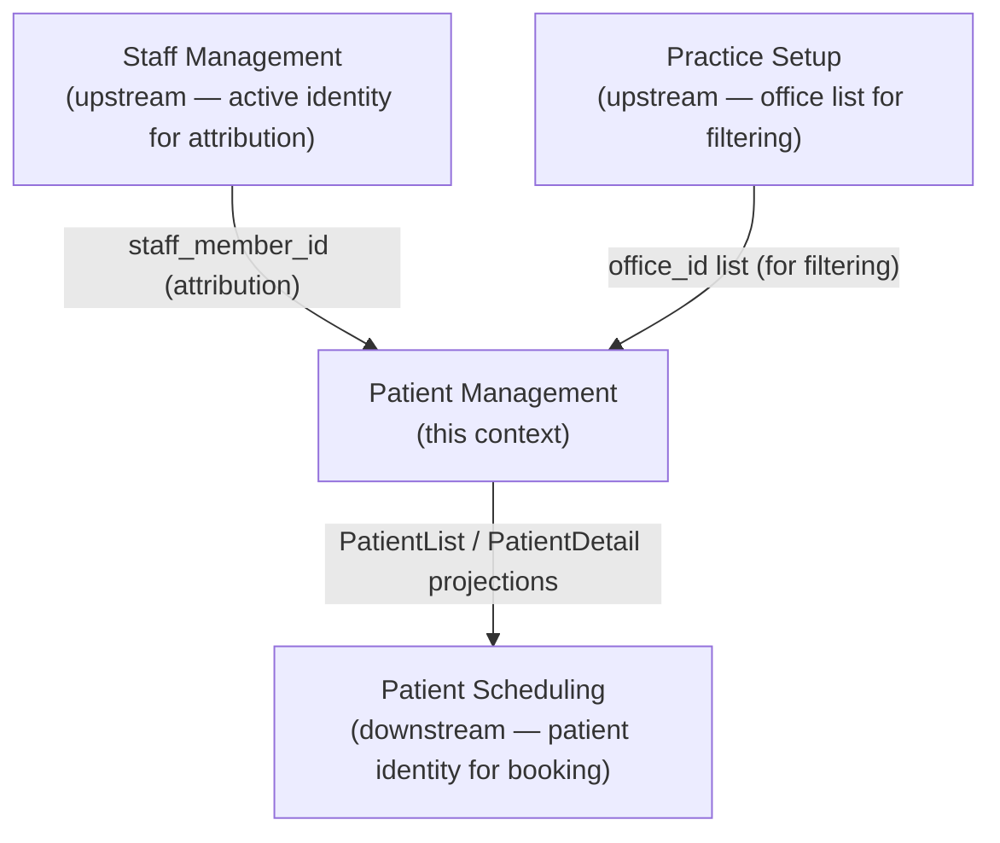
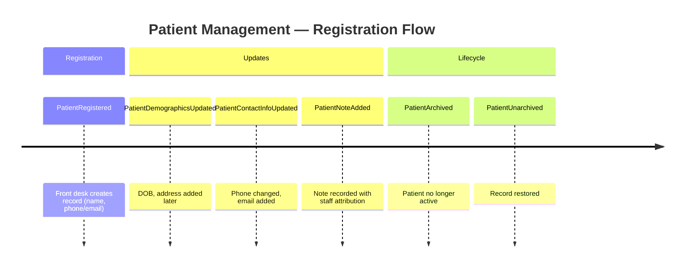

# Event Storming: Patient Management

**Date**: 2026-03-04
**Participants**: Tony (Product Owner), Claude (Architect/Developer)
**Source material mined**: `nico-tony-notes-20260211.md`, `nico-tony-chat-20260225.md`, `feedback-20260218.md`, `context-map.md`
**Status**: Phase 1.1 COMPLETE

---

## Domain Summary

Patient Management is responsible for knowing **who the patients are**. It registers new patients, maintains their demographic and contact information, and provides patient identity to Patient Scheduling for booking.

At MVP, Patient Management is intentionally thin: name, contact info, date of birth, address, and notes. No clinical records (those are post-MVP). All edits are fully audited (who changed what, when).

**"Coming from paper"** context: Most target practices are moving from journals and register books. Patient registration must be simple enough that a receptionist new to software can create a patient record without training.

---

## Events

### Flow 1: Patient Registration

| # | Event (past tense) | Aggregate | Triggered by |
|---|-------------------|-----------|-------------|
| E1 | **PatientRegistered** | Patient | Front desk creates a new patient record |
| E2 | **PatientDemographicsUpdated** | Patient | Front desk or PM updates name, DOB, address |
| E3 | **PatientContactInfoUpdated** | Patient | Front desk updates phone, email, preferred channel |
| E4 | **PatientNoteAdded** | Patient | Any active staff member adds a note |
| E5 | **PatientArchived** | Patient | PM soft-deletes a patient record |
| E6 | **PatientUnarchived** | Patient | PM restores an archived patient |

### Flow 2: Patient Identity for Downstream

These events are consumed by Patient Scheduling. Patient Management does not produce them — it produces E1-E6, and downstream contexts read Patient Management projections.

| Projection | Contents | Consumed By |
|-----------|---------|------------|
| **PatientList** | Active patients with name, phone, DOB (for disambiguation), office_id | Patient Scheduling (booking search), UI (patient list) |
| **PatientDetail** | Full demographics, contact info, notes | UI (patient card view) |

---

## Commands

| Command | Actor | Produces | Preconditions |
|---------|-------|----------|---------------|
| RegisterPatient | Front Desk / Practice Manager | PatientRegistered | name not empty, at least one of phone/email not empty |
| UpdatePatientDemographics | Front Desk / PM | PatientDemographicsUpdated | patient active, name not empty |
| UpdatePatientContactInfo | Front Desk / PM | PatientContactInfoUpdated | patient active |
| AddPatientNote | Any active StaffMember | PatientNoteAdded | patient active, note not empty |
| ArchivePatient | Practice Manager | PatientArchived | patient active |
| UnarchivePatient | Practice Manager | PatientUnarchived | patient archived |

---

## Aggregates

### Patient (singleton per person)

| Field | Type | Required | Notes |
|-------|------|----------|-------|
| id | UUID | Yes | System-generated |
| first_name | String | Yes | |
| last_name | String | Yes | |
| date_of_birth | Date? | No | Strongly recommended — used for disambiguation when two "Maria Brown"s exist |
| phone | String? | Conditional | At least phone or email required |
| email | String? | Conditional | At least phone or email required |
| preferred_contact_channel | PreferredContactChannel | No | WhatsApp default |
| address_line_1 | String? | No | |
| city_town | String? | No | |
| subdivision | String? | No | Parish for Jamaica |
| country | String? | No | "Jamaica" default |
| notes | List<PatientNote> | No | Append-only note list |
| attributed_to | staff_member_id | Yes | Who registered the patient |
| archived | bool | Yes | Default false |

**PatientNote** value object:

| Field | Type | Notes |
|-------|------|-------|
| note_id | UUID | System-generated |
| text | String | Required, non-empty |
| recorded_by | staff_member_id | Required — full audit trail (Nico: "when staff edits patients we need to audit that who did it when!") |
| recorded_at | Timestamp (UTC) | Required |

---

## Hot Spots

### HS-1: Multi-office patient association

**Question**: Is a patient associated with one office (where they primarily receive care), or is the patient record practice-wide and appears at all offices?

**From context-map.md**: "Patient Management reads the list of offices for record filtering (e.g., 'show patients for Kingston')." This implies patients CAN be filtered by office, but doesn't resolve whether they are bound to one.

**Caribbean practice pattern**: Nico's practice has providers rotating between Kingston and Montego Bay. It is plausible that a patient from Kingston ends up seeing a provider in Montego Bay. A hard office binding would make this difficult.

**Assumption**: Patient records are **practice-wide**, not office-bound. An optional `preferred_office_id` field can be set to enable filtering without creating a hard binding. [OPEN QUESTION — Tony to confirm: Is a patient bound to one office, or practice-wide with optional office preference?]

---

### HS-2: Name structure — first/last vs. single name field

**Question**: Should patient name be a single "full name" field or structured first/last?

**Research notes**: Nico's practice has patients with single-word names (Caribbean cultural norm — some patients use only a given name). Using first/last structure requires the front desk to decide how to split a single-word name.

**Assumption**: Two fields — `first_name` and `last_name`. Both required. For single-word names, last_name can be "." or a known convention. [OPEN QUESTION — Tony to confirm: How does Nico's practice handle single-word patient names? Do they leave last_name blank? Use a placeholder?]

**Alternative**: Single `full_name` field with optional structured name fields. Simpler, more flexible.

---

### HS-3: Deduplication / merge

**Question**: What happens when a patient is registered twice (same name + phone)?

**Research notes**: Staff feedback noted duplicate staff members as a significant issue. Same risk applies to patients.

**Assumption at MVP**: Soft warning when registering a patient with the same full name and phone as an existing patient ("A patient with this name and phone number already exists — are you sure?"). No merge workflow at MVP. [OPEN QUESTION — Tony to confirm: Acceptable approach?]

---

### HS-4: Notes travel across modules

**From research**: "free-form notes should travel with the patient across different modules (scheduling, charting)." This means PatientNote is attached to the Patient aggregate and is readable from any context that needs it — Patient Scheduling, Clinical Records (post-MVP), etc. Notes are not context-specific.

**Decision**: Notes belong to Patient Management aggregate. Downstream contexts (Patient Scheduling, Clinical Records) read them via projection. No separate note aggregate per context.

---

### HS-5: Jamaica-specific identifiers (NIS, insurance)

**Research**: Not mentioned explicitly. Jamaica EHR integration is post-MVP.

**Assumption**: NIS number and health insurance identifiers are post-MVP fields, added when Jamaica EHR Integration is designed. Not in Patient Management MVP aggregate.

---

### HS-6: Contact field validation

**Question**: Phone number format validation for Jamaica? (876 country code, etc.)

**Assumption**: Store phone as free-text string, no format enforcement at MVP. Format enforcement is a UX concern, not a domain rule. [ASSUMED — Tony to confirm acceptable]

---

## Bounded Context Summary

---

## Event Chronology (Mermaid)

---

## Open Questions

| # | Question | Assumption | Resolution |
|---|----------|-----------|------------|
| PM-1 | Is a patient bound to one office or practice-wide? | Practice-wide with optional preferred_office_id | [OPEN QUESTION — Tony to confirm] |
| PM-2 | Single-word patient names — first/last split or single field? | First + last (required); Tony to clarify convention for single-word names | [OPEN QUESTION — Tony to confirm] |
| PM-3 | Deduplication approach at MVP | Soft warning on same name + phone, no merge workflow | [OPEN QUESTION — Tony to confirm] |
| PM-4 | NIS/insurance numbers at MVP | Post-MVP | [ASSUMED] |
| PM-5 | Phone format validation | Free-text, no enforcement at MVP | [ASSUMED] |
| PM-6 | Can front desk archive a patient, or only Practice Manager? | Only Practice Manager (matches office/provider archive authority) | [ASSUMED — Tony to confirm] |

---

**Source materials**:
- `belsouri-old/doc/internal/research/nico-tony-notes-20260211.md` — Epic B1-B2, patient creation, required fields
- `belsouri-old/doc/internal/research/Nico & Tony Chat - 2026_02_25 14_58 EST - Notes by Gemini.md` — notes, audit trail, WhatsApp
- `belsouri-old/doc/internal/research/feedback-20260218.md` — patient creation feedback, phone bug, edit missing
- `doc/domain/context-maps/context-map.md` — patient-office filtering, downstream relationships

**Maintained By**: Tony + Claude
