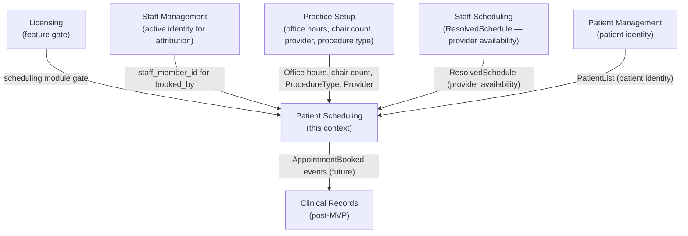
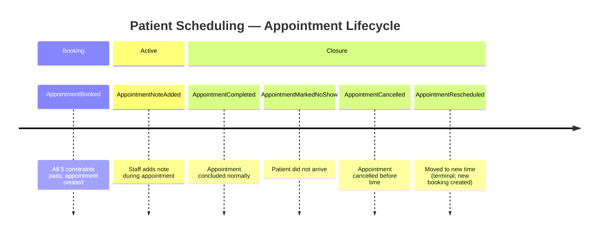

# Event Storming: Patient Scheduling

**Date**: 2026-03-04
**Participants**: Tony (Product Owner), Claude (Architect/Developer)
**Source material mined**: `nico-tony-notes-20260211.md`, `nico-tony-chat-20260225.md`, `feedback-20260218.md`, `practice-setup-examples.md` (Three Amigos Summary)
**Status**: Phase 1.1 COMPLETE

---

## Domain Summary

Patient Scheduling is responsible for booking appointments and maintaining the schedule. It is the **most downstream** context in the MVP — it depends on all other contexts being correctly configured and is the first context the practice's front desk interacts with daily.

MVP booking flow: **Office → Patient → Procedure → Provider → Time slot**

MVP appointment constraint (confirmed Three Amigos, 2026-03-03):
> **Appointment = Patient + Procedure + Provider (available at office at time) + Chair capacity (office has a free chair at that time) + Office (open at that time)**

Chair-procedure matching and provider-procedure matching are **backlog** (not MVP).

---

## Events

### Flow 1: Appointment Booking

| # | Event (past tense) | Aggregate | Triggered by |
|---|-------------------|-----------|-------------|
| E1 | **AppointmentBooked** | Appointment | Front desk books an appointment for a patient |
| E2 | **AppointmentRescheduled** | Appointment | Front desk moves the appointment to a new time/provider/office |
| E3 | **AppointmentCancelled** | Appointment | Front desk or patient cancels |
| E4 | **AppointmentCompleted** | Appointment | Front desk or provider marks appointment as done |
| E5 | **AppointmentMarkedNoShow** | Appointment | Front desk marks the patient as a no-show |
| E6 | **AppointmentNoteAdded** | Appointment | Staff member adds a note to a specific appointment |

### Flow 2: Schedule Queries (read-only)

These are queries against the schedule, not events. No events emitted.

| # | Query | Returns |
|---|-------|---------|
| Q1 | What appointments does office X have today? | AppointmentList for office + date |
| Q2 | What is provider X's schedule for the week? | Weekly appointments for provider |
| Q3 | What are tomorrow's appointments? (call list) | Name + contact info for next-day bookings |

---

## Commands

| Command | Actor | Produces | Preconditions |
|---------|-------|----------|---------------|
| BookAppointment | Front Desk | AppointmentBooked | Office open at time, provider available at office at time, chair capacity not exceeded, patient active, procedure type active. All 5 constraints must pass. |
| RescheduleAppointment | Front Desk | AppointmentRescheduled (original) + implicitly re-validates constraints against new slot | Appointment is in Booked status, new slot passes all booking constraints |
| CancelAppointment | Front Desk | AppointmentCancelled | Appointment is in Booked or Rescheduled status |
| CompleteAppointment | Front Desk / Provider | AppointmentCompleted | Appointment in Booked status |
| MarkNoShow | Front Desk | AppointmentMarkedNoShow | Appointment in Booked status |
| AddAppointmentNote | Any active StaffMember | AppointmentNoteAdded | Appointment exists (any status), note not empty |

---

## Aggregates

### Appointment

| Field | Type | Required | Notes |
|-------|------|----------|-------|
| id | UUID | Yes | System-generated |
| office_id | UUID | Yes | References Practice Setup Office |
| patient_id | UUID | Yes | References Patient Management Patient |
| procedure_type_id | UUID | Yes | References Practice Setup ProcedureType |
| provider_id | UUID | Yes | References Practice Setup Provider |
| start_time | DateTime (UTC) | Yes | |
| end_time | DateTime (UTC) | Yes | Computed from start + duration; editable |
| duration_minutes | u32 | Yes | From procedure type default; overridable (15-240 min) |
| status | AppointmentStatus | Yes | Booked → Completed / Cancelled / NoShow / Rescheduled |
| rescheduled_to_id | UUID? | No | Set when Rescheduled — links to the replacement appointment |
| rescheduled_from_id | UUID? | No | Set on the new appointment — links to the original |
| notes | List<AppointmentNote> | No | Append-only. Audited with staff attribution. |
| booked_by | staff_member_id | Yes | Who created the booking — audit trail |
| archived | bool | No | Reserved — not used at MVP |

**AppointmentStatus**: Booked | Completed | Cancelled | NoShow | Rescheduled

**AppointmentNote** value object:

| Field | Type | Notes |
|-------|------|-------|
| note_id | UUID | System-generated |
| text | String | Required, non-empty |
| recorded_by | staff_member_id | Required — audit trail |
| recorded_at | Timestamp (UTC) | Required |

---

## Booking Constraints (enforced by BookAppointment command)

All five constraints must pass. If any fails, booking is rejected with a specific error:

| # | Constraint | Source | Error if violated |
|---|------------|--------|-------------------|
| C1 | Office is open at the requested time | Practice Setup `OfficeHoursSet` events | "Office [name] is not open at [time] on [day]" |
| C2 | Provider is available at that office at that time | Staff Scheduling `ResolvedSchedule` projection | "Provider [name] is not available at [office] at [time]" |
| C3 | Chair capacity not exceeded | Practice Setup `chair_count` + count of concurrent Booked appointments at that office at that time | "No chairs available at [office] at [time]" |
| C4 | Patient is active (not archived) | Patient Management `PatientList` projection | "Patient is archived and cannot be scheduled" |
| C5 | Procedure type is active (not deactivated) | Practice Setup `ProcedureTypeList` projection | "Procedure type [name] is no longer available" |

**Override policy**: All 5 constraints are **hard stops** at MVP. No override flag for front desk. [OPEN QUESTION — Tony to confirm: Should office hours and chair capacity blockers allow a warning + override, or remain hard stops? The practice may want flexibility for emergency bookings.]

---

## Hot Spots

### HS-1: Override policy — hard stop vs. warn + override

**Question**: If the office is technically closed or all chairs are full, should the system hard-reject, or warn and allow an override for exceptional circumstances?

**From research**: The notes use language like "cannot save (or must explicitly override later)." This suggests Tony intended override capability. However, "paper to digital" users may find warnings confusing.

**Assumption**: Hard stops at MVP. Override capability is a backlog enhancement. [OPEN QUESTION — Tony to confirm]

---

### HS-2: Duration guardrails — editable range

**Question**: What is the min/max editable duration? Practice Setup uses 15-240 minutes for procedure types. Is the same range valid for individual appointment duration override?

**Assumption**: Same range: 15-240 minutes. Booking rejects duration outside this range. [ASSUMED]

---

### HS-3: Reschedule — same or different aggregate?

**Question**: When an appointment is rescheduled, does it produce one event on the existing aggregate (AppointmentRescheduled with new time) or two events — one to close the original (AppointmentCancelled) and one to create a new (AppointmentBooked)?

**Research**: "Original appointment becomes Rescheduled with link to new appointment." This implies the original gets a terminal status (`Rescheduled`) and a new appointment aggregate is created. History shows both.

**Assumption**: Two aggregates: original gets `AppointmentRescheduled` status (terminal), new appointment gets `AppointmentBooked` event. Linked via `rescheduled_to_id` / `rescheduled_from_id` fields. [ASSUMED — aligns with research]

---

### HS-4: No-show and cancel — reversible?

**Question**: Can a cancelled or no-show appointment be "unbounced" (status reversed)?

**Research**: Not mentioned. The lifecycle is presented as one-way transitions.

**Assumption**: Cancelled and NoShow are terminal statuses. Cannot be reversed. If a patient shows up after a no-show is marked, a new appointment is booked. [ASSUMED]

---

### HS-5: Cross-office patient bookings

**Question**: Can a patient have appointments at different offices on the same day? Is there any cross-office conflict check?

**From research**: Chair capacity and provider availability are explicitly **office-scoped**. The research notes: "concurrent appointments at Office A do not affect Office B."

**Assumption**: No cross-office conflict checking at MVP. A patient can have appointments at two different offices on the same day (unusual but technically valid). [ASSUMED]

---

### HS-6: Appointment notes vs. patient notes

**Question**: Should appointment-level notes be separate from patient-level notes (which live in Patient Management)?

**Research**: Patient Management has `PatientNote` (general patient notes). Appointment-level notes would track things specific to a visit ("patient arrived late", "procedure extended 15 minutes").

**Assumption**: Appointment notes are a separate concept from patient notes, owned by the Appointment aggregate. Both are visible from the patient history view. [ASSUMED]

---

### HS-7: Manual call list

**Research**: MVP reminder approach is a "view/report of tomorrow's appointments per office + contact info (manual calling supported)." This is a **query** not an event — Patient Scheduling exposes a `get_tomorrows_appointments(office_id)` query returning appointments with patient phone and preferred_contact_channel.

**Not in MVP scope**: SMS/email integration. Manual call list is the MVP approach.

---

## Bounded Context Summary

---

## Event Chronology (Mermaid)

---

## Open Questions

| # | Question | Assumption | Status |
|---|----------|-----------|--------|
| PS-1 | Hard stops vs. warn + override for office hours and chair capacity? | Hard stops at MVP | [OPEN QUESTION — Tony to confirm] |
| PS-2 | Duration guardrails for individual appointment override? | 15-240 minutes (same as procedure type range) | [ASSUMED] |
| PS-3 | Reschedule model — one aggregate or two? | Two: original gets terminal Rescheduled status, new appointment booked | [ASSUMED — aligns with research] |
| PS-4 | Are Cancelled and NoShow statuses reversible? | No — terminal states | [ASSUMED] |
| PS-5 | Cross-office conflict check for same patient same day? | No — conflicts are office-scoped only | [ASSUMED] |
| PS-6 | Appointment notes separate from patient notes? | Yes — appointment-level notes owned by Appointment aggregate | [ASSUMED] |

---

**Source materials**:
- `belsouri-old/doc/internal/research/nico-tony-notes-20260211.md` — booking flow, constraints, lifecycle, views
- `belsouri-old/doc/internal/research/Nico & Tony Chat - 2026_02_25 14_58 EST - Notes by Gemini.md` — override discussion, chair capacity
- `belsouri-old/doc/internal/research/feedback-20260218.md` — booking UX failures (silent errors)
- `doc/scenarios/example-maps/practice-setup-examples.md` (Three Amigos Summary) — confirmed MVP appointment constraint

**Maintained By**: Tony + Claude
