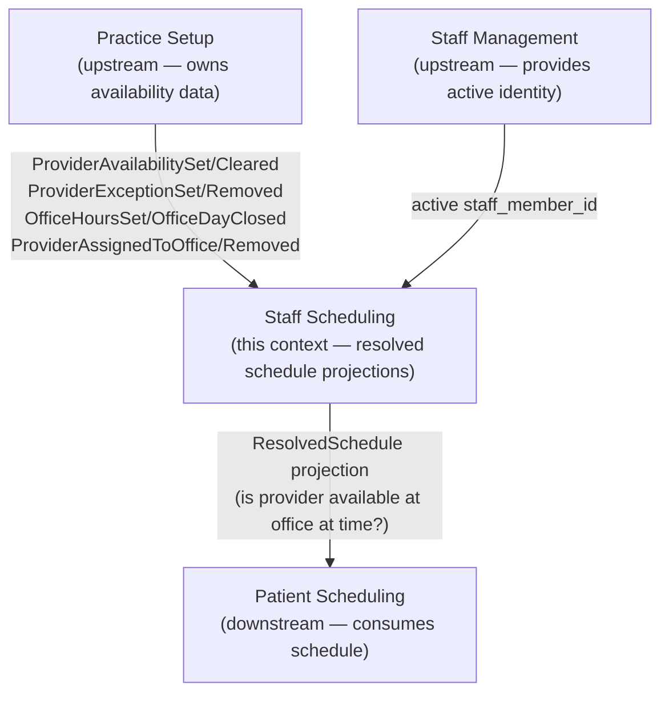
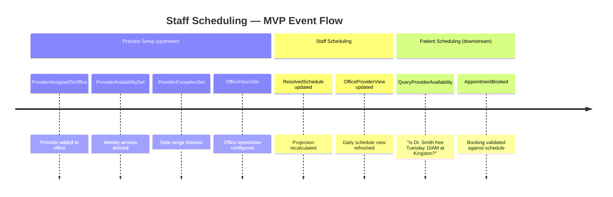

# Event Storming: Staff Scheduling

**Date**: 2026-03-04
**Participants**: Tony (Product Owner), Claude (Architect/Developer)
**Source material mined**: `belsouri-old/doc/internal/research/nico-tony-notes-20260211.md`, `nico-tony-chat-20260225.md`, `feedback-20260218.md`, `provider-aggregate.md`, `context-map.md`
**Status**: Phase 1.1 COMPLETE

---

## Domain Summary

Staff Scheduling answers one core question for the practice: **"When is each provider available at each office?"** This answer is consumed by Patient Scheduling to validate appointment bookings.

At MVP, the raw data that drives scheduling (provider availability windows, exceptions, office hours) is already recorded as events in the Practice Setup bounded context. Staff Scheduling's role is to **materialize a queryable resolved schedule** from those upstream events, and to provide the integration contract that Patient Scheduling consumes.

This means Staff Scheduling at MVP is primarily a **projection-first context** — no new aggregates that own new state; instead it subscribes to Practice Setup events and builds a schedule view. Future releases will add new Staff Scheduling-owned aggregates (time-off request workflow, shift patterns with approval), at which point the boundary may shift.

**[HOT SPOT — see HS-1]**: Should provider availability data stay in Practice Setup or migrate to a Staff Scheduling aggregate? This is the defining architectural question for Phase 3. Documented as HS-1 below.

---

## Events

Events are grouped by flow. Orange events come FROM Practice Setup (consumed, not produced here). Blue events are new Staff Scheduling domain events.

### Flow 1: Availability Configuration (events from Practice Setup)

These events are produced by Practice Setup and consumed by Staff Scheduling to build the resolved schedule projection. Staff Scheduling does not re-emit them.

| # | Event (past tense) | Aggregate | Triggered by |
|---|-------------------|-----------|-------------|
| E1 | **ProviderAssignedToOffice** *(from Practice Setup)* | Provider | Practice Manager assigns provider |
| E2 | **ProviderRemovedFromOffice** *(from Practice Setup)* | Provider | Practice Manager removes provider |
| E3 | **ProviderAvailabilitySet** *(from Practice Setup)* | Provider | Practice Manager sets working window |
| E4 | **ProviderAvailabilityCleared** *(from Practice Setup)* | Provider | Practice Manager removes working window |
| E5 | **ProviderExceptionSet** *(from Practice Setup)* | Provider | Practice Manager blocks a date range |
| E6 | **ProviderExceptionRemoved** *(from Practice Setup)* | Provider | Practice Manager lifts a date block |
| E7 | **ProviderArchived** *(from Practice Setup)* | Provider | Practice Manager archives provider |
| E8 | **OfficeHoursSet** *(from Practice Setup)* | Office | Practice Manager sets office open/close hours |
| E9 | **OfficeDayClosed** *(from Practice Setup)* | Office | Practice Manager closes a day |
| E10 | **OfficeArchived** *(from Practice Setup)* | Office | Practice Manager archives office |

### Flow 2: Schedule Queries (read-only access)

These represent observable facts after schedule is computed. No events emitted — the schedule is projected, not commanded.

| # | Query | Answer |
|---|-------|--------|
| Q1 | Is provider X available at office Y on day D at time T? | Yes / No + reason |
| Q2 | Who is working at office Y on day D? | List of providers with time windows |
| Q3 | What is provider X's schedule for the week of YYYY-MM-DD? | Per-office availability windows + exceptions |
| Q4 | What days does office Y have at least one provider available? | List of open days |

### Flow 3: Future — Time-Off Requests (post-MVP)

These events are NOT in MVP scope. Listed here so the boundary is explicit.

| # | Event (past tense) | Notes |
|---|-------------------|-------|
| F1 | TimeOffRequested | Provider requests time off via app |
| F2 | TimeOffApproved | Practice Manager approves request |
| F3 | TimeOffDenied | Practice Manager denies (day too busy) |
| F4 | TimeOffCancelled | Provider cancels their own request |

---

## Commands

At MVP, the commands that affect schedule data are in Practice Setup. Staff Scheduling issues no write commands of its own at MVP.

| Command | Actor | Produces | Context |
|---------|-------|----------|---------|
| SetProviderAvailability | Practice Manager | ProviderAvailabilitySet | **Practice Setup** |
| ClearProviderAvailability | Practice Manager | ProviderAvailabilityCleared | **Practice Setup** |
| SetProviderException | Practice Manager | ProviderExceptionSet | **Practice Setup** |
| RemoveProviderException | Practice Manager | ProviderExceptionRemoved | **Practice Setup** |
| SetOfficeHours | Practice Manager | OfficeHoursSet | **Practice Setup** |
| QueryProviderAvailability | Patient Scheduling / UI | *(read, no event)* | **Staff Scheduling** |
| ViewOfficeSchedule | Front Desk / UI | *(read, no event)* | **Staff Scheduling** |

---

## Aggregates

At MVP, Staff Scheduling has **no new aggregates**. All state changes that affect the schedule are commanded in Practice Setup and consumed here.

The Staff Scheduling context owns:

| Projection | Purpose | Consumes |
|------------|---------|----------|
| **ResolvedSchedule** | Per-office, per-provider, per-day availability after applying exceptions. The authoritative answer to "is this provider available?" | ProviderAvailabilitySet/Cleared, ProviderExceptionSet/Removed, ProviderArchived, OfficeHoursSet, OfficeDayClosed, OfficeArchived, ProviderAssignedToOffice, ProviderRemovedFromOffice |
| **OfficeProviderView** | Who works at each office and on which days. The "Today's Schedule" starting point. | Same events as above |

---

## Hot Spots

### HS-1: Availability Ownership Boundary (CRITICAL — Tony to decide in Phase 3 Three Amigos)

**Question**: Should provider availability windows and exceptions stay owned by Practice Setup, or should they migrate to Staff Scheduling?

**Current state**: Availability is in Practice Setup. It's natural there during MVP because the Practice Manager configures everything — there's no separate staff scheduling workflow.

**Arguments for staying in Practice Setup:**
- One fewer context to implement at MVP
- Availability is legitimately "practice configuration" (static weekly pattern for a clinician)
- Less code, less complexity

**Arguments for migrating to Staff Scheduling:**
- Clean bounded context: "scheduling data" belongs in the "scheduling context"
- Better positioned for future time-off request workflow (Staff Scheduling would own exceptions too)
- Patient Scheduling's upstream would be Staff Scheduling, not Practice Setup (cleaner dependency)

**Resolution needed**: This is the primary architectural question for Phase 3 Phase 2 Three Amigos. **Assumption for MVP Phase 1 ceremonies: availability stays in Practice Setup, Staff Scheduling is projection-first.**

---

### HS-2: Office-Provider Schedule View — whose responsibility?

**Question**: Is the "daily schedule view" (who's working, when, at what office) a Staff Scheduling responsibility or a Patient Scheduling responsibility?

**Assumption**: Staff Scheduling owns the resolved schedule view. Patient Scheduling reads it. This keeps Patient Scheduling focused on appointments, not availability management.

---

### HS-3: Future — Heat Maps and Load Balancing

The Feb 25 Nico/Tony chat mentions heat maps for rostering and vacation planning: "Mondays are typically busy, making Wednesday a preferred lighter day for time off." This is a future Staff Scheduling feature — aggregate statistics on provider load by day.

**Not in MVP scope**. Note for post-MVP backlog.

---

### HS-4: Staff vs. Provider in Scheduling

Only **Providers** (clinical staff) appear in the scheduling context. **Staff** role (non-clinical: receptionist, office administrator) are tracked in Staff Management but have no scheduling presence. This is consistent with the Staff Management context design.

**No ambiguity** — confirmed boundary.

---

## Bounded Context Summary

**Key relationships**:
- Practice Setup is upstream: all availability data originates there
- Staff Scheduling materializes the resolved schedule
- Patient Scheduling consumes the resolved schedule to validate bookings

---

## Event Chronology (Mermaid)

---

## MVP Scope Decision

**In MVP scope:**
- ResolvedSchedule projection (from Practice Setup events)
- OfficeProviderView projection ("today's schedule" view per office)
- Query interface: is provider available at time/office?
- No new events emitted by Staff Scheduling at MVP

**Not in MVP scope (Post-MVP):**
- TimeOffRequested / Approved / Denied workflow
- Shift patterns (rotating shifts, split shifts)
- Load balancing / heat maps
- Provider-initiated schedule changes

---

## Open Questions

| # | Question | Assumption | Resolution |
|---|----------|-----------|------------|
| SS-1 | Does availability data stay in Practice Setup or migrate to Staff Scheduling? | Stays in Practice Setup for MVP | Phase 3 Three Amigos — [OPEN QUESTION — Tony to confirm] |
| SS-2 | Who can view the schedule view? Any logged-in staff member or only Practice Manager? | Any active staff member | [ASSUMED — Tony to confirm] |
| SS-3 | What is the minimum data in the ResolvedSchedule projection needed for Patient Scheduling? | provider_id, office_id, available_date, start_time, end_time (after exceptions applied) | Phase 3 Example Mapping |
| SS-4 | Should Staff Scheduling track who MADE changes to the schedule (attribution)? | No at MVP — attribution is in Practice Setup events | [ASSUMED] |

---

**Source materials**:
- `belsouri-old/doc/internal/research/nico-tony-notes-20260211.md` — MVP user journeys, booking constraints
- `belsouri-old/doc/internal/research/Nico & Tony Chat - 2026_02_25 14_58 EST - Notes by Gemini.md` — time-off workflow ideas, heat maps
- `doc/domain/aggregates/provider-aggregate.md` — existing availability model
- `doc/domain/context-maps/context-map.md` — context relationships and boundary watch list

**Maintained By**: Tony + Claude
